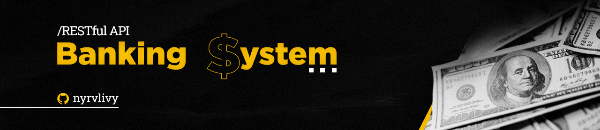

<div align="center">
  
</div>

<h1 align="center">Functional-Banking-System-REST-API</h1>
<p align="center">Backend Development Project: Building a RESTful API for a Functional Banking System Prototype by Cubos Academy.</p>

<div align="center">
  
  
  
  
  
  
</div>

##

## Table of contents

* [Project Description](#project-description)
* [How to Setup?](#how-to-setup)
* [Endpoints](#endpoints)
    <details>
    <summary>Click to expand</summary>

  - [List Accounts](#list-accounts)
  - [Create Account](#create-account)
  - [Update User](#update-user)
  - [Delete Account](#delete-account)
  - [Deposit](#deposit)
  - [Withdraw](#withdraw)
  - [Transfer](#transfer)
  - [Check Balance](#check-balance)
  - [Generate Statement](#generate-statement)

  </details>
  
##

## Project Description

This project is a **RESTful API** designed to efficiently manage and execute fundamental account and user management operations for a _Digital Bank_. Leveraging the power of *Node.js* and *Express*, I have structured my codebase with _Routers, Middlewares, Models, Data,_ and _Controllers_. Within this project, we seamlessly execute a wide range of functions, including _listing operations, creating and updating accounts and users, handling transactions, and performing deletes_ and _updates with ease_.

##

## How to Setup?

- [x] Fork this repository to your GitHub;
- [ ] Clone your repository to your machine;
      
```bash
    git clone https://github.com/your-user/digital-bank-api.git
```

#### Set up your development environment:
- [ ] Make sure you have [Node.js](https://nodejs.org/) installed on your machine. You can download it from [here](https://nodejs.org/).
- [ ] Open the terminal of your preferred [IDE](https://www.codecademy.com/article/what-is-an-ide). Navigate to the project's root directory and install the _dependencies_ with `npm install` or `npm -i`.
```bash
    cd your-bank-project
    npm install
```
- [ ] _**I choose you!**_ Now it's your turn, improve or rebuild my first school project with Node.js, creating a [REST API](https://www.redhat.com/en/topics/api/what-is-a-rest-api) the way you prefer!

**Note:** _If you'd like, create a PR with your changes so I can take a look!_

##

## Endpoints

You can interact with the RESTful API using the following endpoints:

##

### List Accounts
By navigating here, you can view a list of all the registered accounts in your bank.
```bash
    GET localhost:<your_port>/accounts?bank_password=<your_bank_password>
```
##

### Create Account

This endpoint allows you to register new users through accounts in your bank.
```bash
    POST localhost:<your_port>/accounts/
```
To create an account, _make sure to fill in all the required fields_, as shown in the example JSON below:
```json
{
    "name": "Bruna",
    "cpf": "58164973461",
    "birthDate": "1999-28-02",
    "phoneNumber": "11985242589",
    "email": "brunislol@gmail.com",
    "password": "password123"
}
```
##

### Update User

This endpoint allows you to update user information associated with a specific bank account. 
```sh
    PUT localhost:<your_port>/accounts/:accountNumber/user
```
To make updates, provide the required fields in the request body.
```json
{
    "name": "Bruninha",
    "cpf": "15924846825",
    "birthDate": "2002-02-28",
    "phoneNumber": "11985498457",
    "email": "wow@gmail.com",
    "password": "1234"
}
```
##

### Delete Account

Use this endpoint to delete a bank account. 
**Note:** _The account can only be deleted if the balance is zero (no funds remaining)._
```sh
    DELETE localhost:<your_port>/accounts/:accountNumber
```
##

### Deposit

You can deposit money into a bank account using this endpoint. 
```sh
    POST localhost:<your_port>/transactions/deposit
```
Ensure that you provide the account number and the amount to deposit in the request body.
```json
{
    "accountNumber": "000001",
    "amount": 10000
}
```
##

### Withdraw

Withdraw money from a bank account through this endpoint.
```sh
    POST localhost:<your_port>/transactions/withdraw
```
Make sure to include the account number, withdrawal amount, and account password in the request body.
```json
{
    "accountNumber": "000001",
    "password": "1234",
    "amount": 10000
}
```
##

### Transfer

Transfer money between bank accounts using this endpoint. 
```sh
    POST localhost:<your_port>/transactions/transfer
```
Provide the source account number, destination account number, transfer amount, and source account password in the request body.
```json
{
    "sourceAccountNumber": "000001",
    "destinationAccountNumber": "000002",
    "password": "1234",
    "amount": 10000
}
```
##

### Check Balance

Get the account balance of a specific bank account by using this endpoint. 
```sh
    GET localhost:<your_port>/accounts/balance?accountNumber=<account_number>&password=<account_password>
```
Provide the account number and account password as query parameters.
```sh
    GET localhost:3000/accounts/balance?accountNumber=000001&password=1234
```

##

### Generate Statement

Retrieve the transaction history (statement) of a bank account using this endpoint. 
```sh
    GET localhost:<your_port>/accounts/statement?accountNumber=<account_number>&password=<account_password>
```
Provide the account number and account password as query parameters.
```sh
    GET localhost:3000/accounts/statement?accountNumber=000001&password=1234
```

##

<div align="center">
  
  **Finally, I would like to mention that this project is just the beginning! Soon, we will have new features and better organization, including the implementation of a real database.**
  
</div>

##
    
###### tags: `Backend` `nodeJS` `REST API` `express` `npm` `challenge`

<div align="center">
  
</div>

